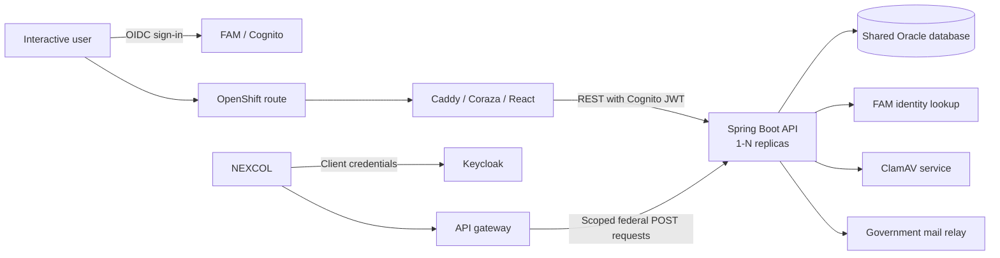

# LEXIS architecture

LEXIS is a React single-page application backed by a Spring Boot API. It preserves the shared
Oracle data model and established log-export business workflows while replacing the legacy
server-rendered Java application and its application-server integrations.

## Runtime overview

The frontend and backend are separate container images. Caddy serves the static application,
applies Coraza WAF rules, and proxies API traffic to the backend. The backend owns authorization,
validation, workflow coordination, reporting, file inspection, and Oracle access. ClamAV runs as a
separate service beside the application workloads.

## Component responsibilities

| Component                | Responsibility                                                                                                                                                         |
| ------------------------ | ---------------------------------------------------------------------------------------------------------------------------------------------------------------------- |
| React frontend           | Interactive provincial, federal, reporting, administration, and RTM AMV journeys. It uses backend-provided capabilities to control navigation and actions.             |
| Spring Boot backend      | REST endpoints, object- and client-level authorization, Oracle workflow coordination, report generation, attachment validation, email events, and operational metrics. |
| Oracle                   | System of record for LEXIS data, reference codes, audit fields, attachments, and the established PL/SQL package contracts.                                             |
| ClamAV                   | Malware scanning for uploaded content before accepted files are persisted.                                                                                             |
| FAM / Cognito            | Interactive authentication and FAM role authorities, including client-scoped Provincial Submitter access.                                                              |
| Keycloak and API gateway | Dedicated machine-to-machine authentication, scope enforcement, traffic controls, and routing for NEXCOL federal submissions.                                          |
| Mail relay               | Delivery of post-commit workflow notifications from one LEXIS sender to validated applicant addresses and configured regional distribution lists.                      |

## Identity and authorization

Interactive users authenticate through FAM's Cognito integration. The backend validates the JWT,
normalizes FAM authorities, derives the authenticated forest-client scope where applicable, and
enforces access again for every protected object, child resource, download, and mutation. The
frontend treats its route and action guards as user experience controls rather than the security
boundary.

NEXCOL does not use an interactive FAM role. It obtains a Keycloak service-client token with the
`lexis:federal-submission:submit` scope and reaches only the federal validation and submission
endpoints exposed by the API gateway. The backend independently validates the forwarded token and
scope.

## Data, files, reports, and integrations

- Oracle remains the system of record; this modernization does not move LEXIS data to another
  database or object store.
- Application, exemption, permit, invoice, and related attachments remain Oracle BLOBs. Uploads
  are size-bounded, type-checked, archive-bounded, and scanned before persistence.
- JasperReports runs inside the backend using checked-in JRXML templates. CSV and spreadsheet
  outputs are generated by the backend and streamed to clients.
- Canadian permit invoicing remains internal to LEXIS. Non-Canadian invoicing uses the established
  GBMS Oracle package sequence with ordered best-effort coordination and explicit reconciliation
  guidance.
- Provincial submissions enter through the authenticated LEXIS UI. Federal submissions enter
  through NEXCOL and the scoped API path; the modern request path does not recreate the legacy ESF
  application queues.
- Workflow email is published after the database transaction commits and delivered asynchronously
  on a best-effort basis. DEV and TEST replace original recipients with configured override
  recipients.

## Deployment and operations

GitHub Actions builds and scans the frontend, backend, and ClamAV images, then deploys them to BC
Gov's Gold OpenShift cluster. Environment-specific credentials are supplied through GitHub
environment secrets and OpenShift Secrets; non-sensitive behavior is supplied through environment
variables and template parameters.

Pull requests deploy an isolated DEV preview after their required builds and tests pass. A merge to
`main` deploys the accepted images to the persistent TEST environment and runs the smoke suite.
Production deployment and image promotion remain disabled until production readiness is approved.

The backend deployment uses a CPU-based Horizontal Pod Autoscaler with environment-specific minimum
and maximum replica counts. Interactive saves use optimistic version checks: stale saves return a
conflict instead of silently replacing newer work. Short multi-row mutations take Oracle row locks
in a consistent order and rely on Oracle transactions, constraints, and conditional updates for
correctness across replicas. No Redis service is required.

The daily expiry process is disabled by default and is enabled per environment. JDBC ShedLock uses
`THE.LEXIS_SHEDLOCK` and the existing Oracle datasource so only one backend replica executes a
trigger. It processes each eligible exemption independently, leaves unsuccessful aggregates
eligible for a later run, and publishes metrics for operational monitoring.

Federal validation and CREATE are replica-safe for the NEXCOL contract. CREATE uses best-effort
same-replica replay, while the Oracle package primary key and the application/package/scale
transaction prevent a duplicate package from committing across replicas. A cross-replica retry
that finds an existing package receives a conflict for NEXCOL reconciliation.

## Legacy-to-modern architecture shifts

| Concern              | Legacy                                                                  | Modern                                                                                                                   |
| -------------------- | ----------------------------------------------------------------------- | ------------------------------------------------------------------------------------------------------------------------ |
| Application delivery | Java 8 WAR deployed to an application server                            | Separate React/Caddy, Spring Boot, and ClamAV workloads on OpenShift                                                     |
| Web architecture     | Struts actions, JSP pages, browser JavaScript, and server HTTP sessions | React SPA, typed REST contracts, stateless JWT authentication, and Spring services                                       |
| Interactive identity | WebADE filters, roles, and organization context                         | FAM roles through Cognito JWTs, backend capability resolution, and explicit client/object checks                         |
| Federal ingress      | ESF queue-oriented ingestion                                            | NEXCOL through a dedicated Keycloak scope and API gateway routes                                                         |
| Persistence          | Oracle tables and PL/SQL packages                                       | The same Oracle system of record behind Spring JDBC repositories and explicit transaction boundaries                     |
| Attachments          | Oracle BLOB storage through application-server upload actions           | Oracle BLOB storage with bounded streaming validation and ClamAV scanning                                                |
| Reports              | Application-server/WebADE report integration and legacy report assets   | Embedded JasperReports with checked-in templates and streamed HTTP responses                                             |
| Email                | Request-coupled JavaMail flows with client and regional recipients      | After-commit asynchronous events, validated recipients, regional distribution-list routing, and non-production overrides |
| Concurrency          | Process/session-scoped edit locks in a single runtime                   | Optimistic stale-save conflicts plus ordered Oracle row locks for transactional multi-row mutations                       |
| Delivery             | Legacy build and deployment pipeline                                    | GitHub Actions, container images, security checks, and parameterized OpenShift deployments                               |

The modernization intentionally preserves Oracle contracts, core workflow semantics, BLOB storage,
and the legacy-compatible GBMS sequence. Framework, identity, delivery, ingress, and operational
controls change without introducing another persistence or coordination service.

## Related documentation

- [Backend configuration and API areas](../backend/README.md)
- [Frontend configuration and structure](../frontend/README.md)
- [NEXCOL service-client contract](nexcol-keycloak-service-client.md)
- [Permit invoicing](permit-invoicing.md)
- [Exemption expiry job](exemption-expiry-job.md)
- [Outbound email](outbound-email.md)
