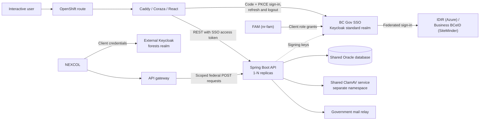
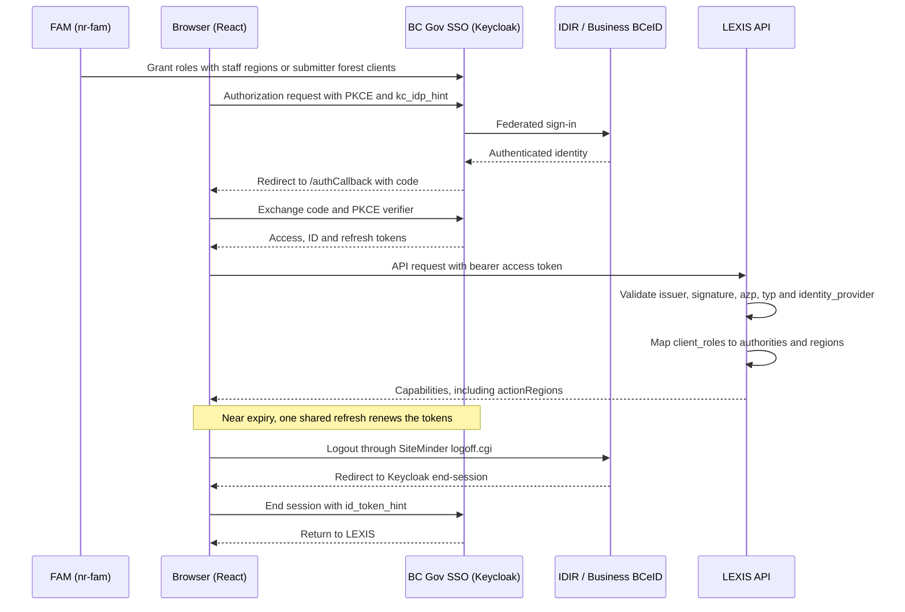
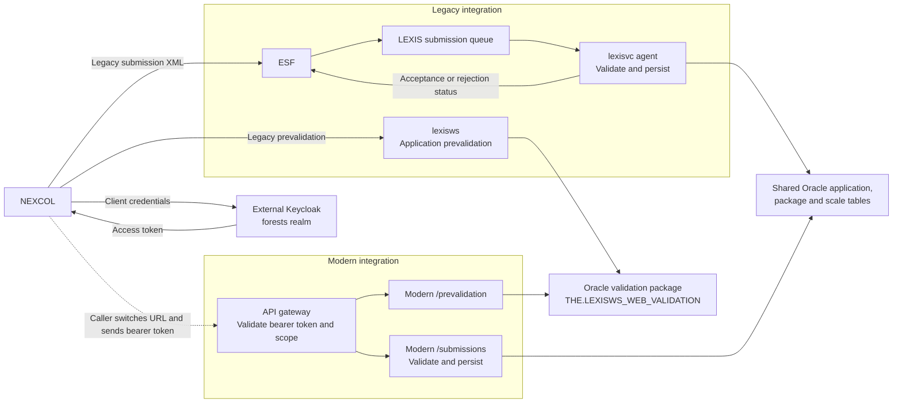
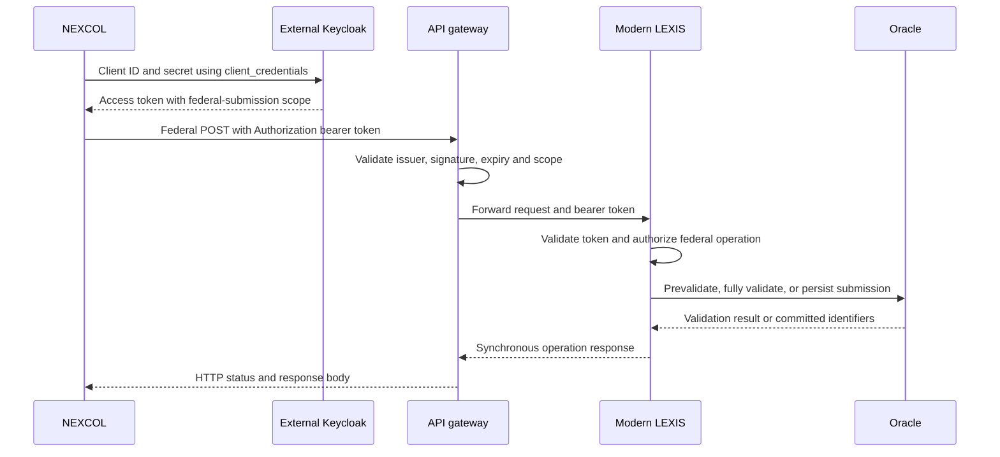

# LEXIS architecture

LEXIS is a React single-page application backed by a Spring Boot API. It preserves the shared
Oracle data model and established log-export business workflows while replacing the legacy
server-rendered Java application and its application-server integrations.

## Runtime overview

```mermaid
flowchart LR
    User["Interactive user"] --> Route["OpenShift route"]
    Route --> Frontend["Caddy / Coraza / React"]
    Frontend -->|"Code + PKCE sign-in,<br/>refresh and logout"| Sso["BC Gov SSO<br/>Keycloak standard realm"]
    Sso -->|Federated sign-in| Idp["IDIR (Azure) /<br/>Business BCeID (SiteMinder)"]
    Fam["FAM (nr-fam)"] -->|Client role grants| Sso
    Frontend -->|REST with SSO access token| Backend["Spring Boot API<br/>1-N replicas"]
    Backend -.->|Signing keys| Sso

    Nexcol[NEXCOL] -->|Client credentials| Keycloak["External Keycloak<br/>forests realm"]
    Nexcol --> Gateway["API gateway"]
    Gateway -->|Scoped federal POST requests| Backend

    Backend --> Oracle[("Shared Oracle database")]
    Backend --> ClamAV["Shared ClamAV service<br/>separate namespace"]
    Backend --> Mail["Government mail relay"]
```

The frontend and backend are separate container images. Caddy serves the static application,
applies Coraza WAF rules, and proxies API traffic to the backend. The backend owns authorization,
validation, workflow coordination, reporting, file inspection, and Oracle access. ClamAV is a
shared service in a separate namespace; the backend reaches its cluster-internal `clamd` endpoint
over TCP rather than deploying a scanner workload of its own.

## Component responsibilities

| Component                | Responsibility                                                                                                                                                         |
| ------------------------ | ---------------------------------------------------------------------------------------------------------------------------------------------------------------------- |
| React frontend           | Interactive provincial, federal, reporting, administration, and RTM AMV journeys. It uses backend-provided capabilities, including per-action regions, to control navigation, actions, and region choices. |
| Spring Boot backend      | REST endpoints, object- and client-level authorization, Oracle workflow coordination, report generation, attachment validation, email events, and operational metrics. |
| Oracle                   | System of record for LEXIS data, reference codes, audit fields, attachments, and the established PL/SQL package contracts.                                             |
| Shared ClamAV            | Malware scanning for uploaded content before accepted files are persisted. The scanner service and signature updates are operated separately from LEXIS.              |
| BC Gov SSO and FAM       | Interactive sign-in through the Keycloak standard realm; FAM (nr-fam) grants its client roles, including client-scoped Provincial Submitter and region-scoped staff access. |
| Keycloak and API gateway | Dedicated machine-to-machine authentication, scope enforcement, traffic controls, and routing for NEXCOL federal submissions.                                          |
| Mail relay               | Delivery of post-commit workflow notifications from provincial and regional positional mailboxes to validated applicants and regional positional recipients.            |

Prefer persistent inline banners for action success, warning, and failure feedback within the owning page, form, or dialog; use a toast only when no suitable inline location exists, such as session renewal. Each page, form, or dialog shows only its latest action result: a new result replaces the previous one, including when its severity changes, and dismissing it must not reveal an older result. Hold that result in one `ActionResult` state rendered by `ActionResultNotification`; opening or leaving an editor clears only a failed attempt, never a committed result the user still needs to see. Keep contextual notices, such as unavailable reference data or a locked record, independent. A multi-record action, such as a batch approval or a multi-file upload, is the exception: when some records succeed and others fail, its latest result is at most one success and one failure notification (`actionMessageResults`, `ActionResultNotifications`), which can list their records with `ActionResult.items`, rather than one warning that folds them together. Single-record flows keep one result (`combineActionMessages`). Use blue for information, green for successful actions, red for failures, and amber for warnings or partial success that needs attention. Clear the previous action result when opening a new confirmation, reveal off-screen feedback after each action attempt, and distinguish a successful write from a failed refresh.

## Identity and authorization

Interactive users authenticate directly through BC Gov SSO, with access managed in nr-fam/CSS.
The backend validates signature, issuer, expiry, access-token type and the configured LEXIS client
ID (`azp`), then translates client roles into its existing internal authorities. The signed
`identity_provider` claim separates IDIR staff (`idir` or `azureidir`) from Business BCeID
(`bceidbusiness`) Provincial Submitter and Federal Read Only roles. Missing or unknown providers
and incompatible roles grant no corresponding authority. A Business BCeID account holds either
Provincial Submitter (for one or more forest clients) or Federal Read Only; an account assigned
both gets no LEXIS access and sees the no-access page until FAM removes one. Scoped roles such as
`LEXIS_PROVINCIAL_SUBMITTER_FOREST_CLIENT-00001018` retain their eight-digit client scope;
`FAM:` metadata roles grant no application access. Audit usernames keep legacy LEXIS's WebADE
form, `IDIR\USERNAME` or `BCEID\USERNAME` in upper case, so users keep one name across legacy and
modern rows.
When FAM assigns a Provincial Submitter to multiple forest clients, LEXIS requires a per-session
active organization selection. The frontend sends that selection with each API request and the
backend validates it against the client-scoped FAM authorities before enforcing it for every
protected object, child resource, download, and mutation. The frontend treats its route and action
guards as user experience controls rather than the security boundary.

Application Approver, Exemption Approver and Read Only are granted per Natural Resource Region
through the region-scoped FAM roles `LEXIS_APPLICATION_APPROVER_REGION`,
`LEXIS_EXEMPTION_APPROVER_REGION` and `LEXIS_READ_ONLY_REGION`, displayed as Application Approver,
Exemption Approver and Read Only. The unscoped roles `LEXIS_APPLICATION_APPROVER`,
`LEXIS_EXEMPTION_APPROVER` and `LEXIS_READ_ONLY` are not valid and give no access. Administrator is
province-wide. A regional grant such as `LEXIS_APPLICATION_APPROVER_REGION_REGION-CARIBOO` carries
the same actions for records in its regions only (organization units 1903-1910). Each grant keeps
its own regions, and record checks apply the regions of both the surface and the action the route
authorized, so Read Only assigned all eight regions plus Cariboo Application Approver reads
across the current regions but writes only in Cariboo. Writing or approving a multi-region record
requires every region, including
creating an application under an exemption, linking or unlinking an exemption's applications,
removing its documents and sending its approval emails. Activating an exemption through a save or create is an approval, so it needs the regions of
the user's Exemption Approver grants rather than those of the route's save or create action.
Creating a permit from an exemption needs one of its regions, and the permit's own region must be
granted. A regional user's reports must name only their regions, including the tenure type and
timber mark analyses that legacy always ran province-wide; a region sent as either `region` or
`orgUnitNumber` is copied to the other key before authorization, so the report filters on exactly
what was authorized. Records without a region, or
still tagged with a pre-2010 forest region, are outside every regional grant. Administrator and
Business BCeID roles are never regional. Session capabilities list each region-limited action's regions
(`actionRegions`), so region pickers offer only usable regions and write actions are hidden on
records outside them; out-of-region federal applications open read-only and offers are not
editable.

Default zone preferences are offered to Administrators and staff whose every granted search covers
all eight current regions. For other regional staff, searches use their assigned regions without a
saved zone preference. Selecting all eight never grants access to retired regions or records
without a current region.

### Mixed grants

Application Approver and Exemption Approver cannot be held together, in any regions, including
alongside Administrator. The check counts every form of both roles, including the invalid unscoped
ones. Interactive token conversion removes all application authorities from such an account. Its capabilities response contains no roles or actions and includes
`accessDeniedReason: INCOMPATIBLE_APPROVER_ROLES`, so the signed-in user sees the no-access page
with a general instruction to contact their administrator, who removes one of the roles in FAM.
Business and administration API routes remain forbidden until a new token has a compatible
assignment.

Read Only may accompany one approver role. Each grant retains its own regions: Read Only
assigned all eight can read current-region records while Cariboo Application Approver writes
only in Cariboo. Capabilities tied to a role also stay within that role's regions. For example,
Read Only in Cariboo plus Exemption Approver in Skeena sees Ministerial exemptions in both,
approves only in Skeena, and sees other exemption types only in Cariboo. Multiple regional
grants for the same role combine.

Legacy LEXIS offers no precedent: WebADE gave each user one set of organizations that limited the
search lists of every non-administrator role alike, and detail pages and actions never checked
region. The per-grant model applies to the accepted FAM regional roles.

### Interactive sign-in

```mermaid
sequenceDiagram
    participant F as FAM (nr-fam)
    participant U as Browser (React)
    participant S as BC Gov SSO (Keycloak)
    participant I as IDIR / Business BCeID
    participant B as LEXIS API
    F->>S: Grant roles with staff regions or submitter forest clients
    U->>S: Authorization request with PKCE and kc_idp_hint
    S->>I: Federated sign-in
    I-->>S: Authenticated identity
    S-->>U: Redirect to /authCallback with code
    U->>S: Exchange code and PKCE verifier
    S-->>U: Access, ID and refresh tokens
    U->>B: API request with bearer access token
    B->>B: Validate issuer, signature, azp, typ and identity_provider
    B->>B: Map client_roles to authorities and regions
    B-->>U: Capabilities, including actionRegions
    Note over U,S: Near expiry, one shared refresh renews the tokens
    U->>I: Logout through SiteMinder logoff.cgi
    I-->>U: Redirect to Keycloak end-session
    U->>S: End session with id_token_hint
    S-->>U: Return to LEXIS
```

The browser uses the public LEXIS client with no secret and keeps tokens in sessionStorage, so
each tab signs in separately. It renews from the refresh token on activity and before API calls,
sharing one renewal between concurrent callers, and signs out after 25 idle minutes. A failed
renewal ends the session only when SSO rejects the refresh token as `invalid_grant` or none is
stored. A network failure or temporary SSO error fails only the affected request, and later activity
tries again. Logout chains SiteMinder `logoff.cgi` before Keycloak end-session so a Business BCeID
SiteMinder session does not survive LEXIS logout.

FAM delegated administration controls who may assign the LEXIS application roles. It is a FAM
permission type, not a LEXIS runtime role, and does not grant or appear as application access. FAM
should prevent incompatible identity/role assignments at provisioning time; the backend token guard
is the authoritative runtime control.

NEXCOL does not use an interactive FAM role. It obtains a Keycloak service-client token with the
`lexis:federal-submission:submit` scope and reaches only the federal field-prevalidation, XML
validation, and submission endpoints exposed by the API gateway. The backend independently
validates the forwarded token and scope.

## Data, files, reports, and integrations

- Oracle remains the system of record; this modernization does not move LEXIS data to another
  database or object store.
- Application, exemption, permit, invoice, and related attachments remain Oracle BLOBs. Uploads
  are size-bounded, type-checked, archive-bounded, and scanned before persistence.
- JasperReports runs inside the backend using checked-in JRXML templates and image-provided fonts
  for PDF compatibility. Render failures are returned as controlled report-generation errors and
  recorded with `event=lexis_report` audit fields. CSV and spreadsheet outputs are generated by
  the backend and streamed to clients.
- Permit detail pages render the permit summary first, then load associated applications and
  package tables. The core-table endpoint returns the authorized applications, packages, and scales
  in one response; the initial permit exemption context reuses the exemption-detail response, and
  fee and GBMS history remain deferred. For normal permits, the backend consumes the existing
  package cursor once, derives application relationships from that same result, and groups the
  existing scale-by-application cursor in a request-scoped lookup. The costly candidate-application
  lookup is deferred until an editor focuses the “Available application” selector, and owner/agent
  client details load only after either corresponding tab is opened. This avoids browser fan-out,
  repeated per-package Oracle reads, and unneeded client lookups or candidate-scale cursors without
  bypassing application authorization. Table-dependent edits and review requests remain unavailable while those
  tables load or refresh, preventing actions against stale data. Package-scoped endpoints verify a
  direct Oracle relationship rather than reloading normal and Blanket OIC package lists for every
  request.
- Canadian permit invoicing remains internal to LEXIS. Non-Canadian invoicing uses the established
  GBMS Oracle package sequence with ordered best-effort coordination and explicit reconciliation
  guidance.
- Provincial submissions enter through the authenticated LEXIS UI. Federal submissions enter
  through NEXCOL and the scoped API path; the modern request path does not recreate the legacy ESF
  application queues.
- Workflow email is published after the database transaction commits and delivered asynchronously
  on a best-effort basis. DEV and TEST replace original recipients with configured override
  recipients.

## NEXCOL ingress and cutover

Modern LEXIS replaces two independent NEXCOL integrations: legacy SOAP application prevalidation
and ESF submission processing. NEXCOL controls when its client calls switch to the gateway. Starting
modern LEXIS or changing the interactive LEXIS URL does not redirect either integration.

The LEXIS agents, SOAP services, and ESF integration can remain available after the main legacy
LEXIS web application is sunset. They continue processing against the shared Oracle data model
and have a separate retirement lifecycle.

The [NEXCOL API contract](nexcol-keycloak-service-client.md) contains request examples, response
schemas, environment URLs, and the detailed retry contract.

### Legacy and modern paths

```mermaid
flowchart LR
    N[NEXCOL]

    subgraph Legacy["Legacy integration"]
        W["lexisws<br/>Application prevalidation"]
        E[ESF]
        Q[LEXIS submission queue]
        C["lexisvc agent<br/>Validate and persist"]
        E --> Q --> C
        C -->|Acceptance or rejection status| E
    end

    subgraph Modern["Modern integration"]
        G["API gateway<br/>Validate bearer token and scope"]
        P["Modern /prevalidation"]
        S["Modern /submissions<br/>Validate and persist"]
        G --> P
        G --> S
    end

    K["External Keycloak<br/>forests realm"]
    V["Oracle validation package<br/>THE.LEXISWS_WEB_VALIDATION"]
    D["Shared Oracle application,<br/>package and scale tables"]

    N -->|Legacy prevalidation| W
    N -->|Legacy submission XML| E
    N -->|Client credentials| K
    K -->|Access token| N
    N -.->|Caller switches URL and sends bearer token| G
    W --> V
    P --> V
    C --> D
    S --> D
```

The diagram shows application prevalidation and CREATE. The additional legacy biweekly lookup,
which NEXCOL no longer uses, is summarized below. Modern LEXIS also exposes a full-submission
`/validation` endpoint, which performs validation without creating business records. Modern
endpoints run in the same Spring Boot backend and independently validate the forwarded token.

| Stage | Legacy behavior | Modern behavior |
| --- | --- | --- |
| Application prevalidation | `lexisws` exposes `LogExportWebService.isValidApplication`; checks client number, client location, boom/package number, and timber marks. | `POST /api/lexis/federal/submissions/prevalidation` reproduces those checks and calls the same Oracle procedures directly. |
| Submission intake | ESF uploads and schema-validates the XML, saves an ESF submission record, and routes a file message according to the schema/version queue mapping. | NEXCOL sends XML to `POST /api/lexis/federal/submissions`; the gateway forwards it to modern LEXIS. |
| Business validation and persistence | `lexisvc` consumes the queue, resolves the ESF submitter through WebADE, requires `FEDERAL_SUBMITTER` for federal applications, validates the data, and creates the application and applicable package/scale records. | Modern LEXIS authorizes the machine-client scope, validates the payload, and writes the application and applicable package/scale records in one Oracle transaction. |
| Completion | ESF finalization acknowledges intake. The queue agent later sends acceptance or rejection through the ESF status queue. | The submission response is synchronous: `201` means persisted; validation failures return `422`. No ESF status-polling endpoint is recreated. |
| System of record | Legacy LEXIS Oracle tables and packages. | The same Oracle data model; no transfer from a legacy database into a separate modern database is introduced. |

The legacy `lexisvc` queue agent and `lexisws` SOAP application are separate components from the
legacy LEXIS web application. The queue agent supports federal and provincial submissions. ESF
also serves other applications, so the LEXIS integration has a separate lifecycle from shared ESF.

### Legacy biweekly SOAP lookup

`lexisws` also exposes `BiWeeklyListWebService.isValidApplicationNumber`. It checks whether an
existing LEXIS application's advertising date matches a supplied date and returns the match result
and actual advertising date. This lookup is separate from application prevalidation and ESF
submission processing.

The federal NEXCOL team confirmed that this service has been removed from `NEXCOL.LexisAPI` and is
no longer used by NEXCOL. No modern replacement is required for NEXCOL.

### NEXCOL Keycloak authentication

Keycloak is hosted separately from LEXIS. NEXCOL uses a dedicated confidential client in the
existing `forests` realm, independently of interactive nr-fam / BC Gov SSO authentication.

The [NEXCOL API documentation](https://openapi.apps.gov.bc.ca/?url=https://raw.githubusercontent.com/bcgov/nr-lexis/main/gateway/openapi.yaml)
covers token endpoints, client credentials, the required scope, and request examples.

### Gateway and backend authorization

```mermaid
sequenceDiagram
    participant N as NEXCOL
    participant K as External Keycloak
    participant G as API gateway
    participant B as Modern LEXIS
    participant O as Oracle
    N->>K: Client ID and secret using client_credentials
    K-->>N: Access token with federal-submission scope
    N->>G: Federal POST with Authorization bearer token
    G->>G: Validate issuer, signature, expiry and scope
    G->>B: Forward request and bearer token
    B->>B: Validate token and authorize federal operation
    B->>O: Prevalidate, fully validate, or persist submission
    O-->>B: Validation result or committed identifiers
    B-->>G: Synchronous operation response
    G-->>N: HTTP status and response body
```

The gateway configures POST routes for the three federal paths, with separate OPTIONS handling
for Swagger CORS. These are [Kong prefix matches](https://developer.konghq.com/gateway/routing/traditional/#path),
so matching descendants can also reach the backend; backend authorization permits the three
concrete federal operations and denies unrecognized paths. The gateway accepts JWTs from the
Authorization header; query-string and cookie token extraction are disabled. Current
configuration requires the environment's `forests` issuer,
RS256 signature verification, expiry, and `lexis:federal-submission:submit`. `allowed_aud` is
currently unset; neither the gateway configuration nor backend adds a dedicated audience/client-ID
binding. Access therefore depends on valid issuer-signed tokens and the federal-submission scope.
The [provisioning script](../.github/scripts/ensure-keycloak-scopes.sh) restricts that scope to the
approved NEXCOL client. A client ID is used for provisioning and caller identity, but it is not an
extra runtime allowlist check.

The [backend token configuration](../backend/src/main/java/ca/bc/gov/mof/lexis/security/Oauth2SecurityCustomizer.java)
registers `LEXIS_OIDC_ISSUER_URI` for interactive users and the separate `KEYCLOAK_ISSUER_URI`
for machine clients. Interactive tokens produce compatible FAM role authorities; machine tokens
produce scope authorities. The interactive client is bound through `LEXIS_OIDC_CLIENT_ID`; this
does not change the machine-client trust model described above.
`SCOPE_lexis:federal-submission:submit` maps only to `uploadFederalSubmission`, which
protects the three federal endpoints. It grants no interactive LEXIS role or general record-read
access. The backend trusts one configured Keycloak issuer for machine clients.

The gateway forwards to `nr-lexis-backend-${ZONE}.da5fad-${ZONE}.svc:8080` on Gold. The backend
NetworkPolicy permits the matching environment in the APS Gold gateway namespace and the LEXIS
frontend, plus monitoring. The backend template declares no public Route and does not admit the
OpenShift ingress router. Caddy refuses the federal machine paths on the public frontend route.
NEXCOL therefore uses the gateway URL, independently of the interactive LEXIS URL. CORS supports
the OpenAPI browser console; NEXCOL's server-to-server access is controlled by tokens and scope.

## Deployment and operations

GitHub Actions builds and scans the frontend and backend images, then deploys them to BC Gov's Gold
OpenShift cluster. The reusable deployment workflow derives the shared scanner endpoint from the
environment-specific `CLAMAV_NAMESPACE` secret. Environment-specific credentials are supplied
through GitHub environment secrets and OpenShift Secrets; non-sensitive behavior is supplied through
environment variables and template parameters. Keep deployment secrets and variables out of the
repository level: an environment value replaces a same-named repository value only when it exists,
so a missing TEST or PROD value would otherwise inherit the repository one. Each deployment job
also fails before deploying unless `OC_NAMESPACE` ends in `-<environment>`. The OpenShift deployer
action (v4.2.2 or later) keeps rendered templates, which include Secret values, out of workflow
logs; don't pin an older version or print rendered templates from other steps.

Pull requests deploy an isolated DEV preview after their required builds and tests pass. A merge to
`main` deploys the accepted images to TEST and runs the smoke suite. PROD deployment requires a
user to run **Release PROD** from `main` with an existing Git tag. Merges and tag creation do not
start PROD deployments. The PROD GitHub Environment must allow deployments from the `main`
branch, because the release tag is an input to that workflow.

### Image promotion model

LEXIS follows the [BC Gov quickstart-openshift](https://github.com/bcgov/quickstart-openshift)
build-once/promote model. Pull requests build frontend and backend images with PR-number tags.
The Merge workflow resolves those tags to immutable digests before deploying TEST. After the
smoke suite passes, it records the commit and exact image pair in a release-candidate artifact.
Release PROD requires a tag on a commit in `main`, a successful Merge run for that commit, and its
matching release-candidate artifact. It deploys the recorded digests and the tagged commit's
OpenShift templates. It does not rebuild images or resolve the mutable PR tags again.

PR images are built before merge. Before merging another application PR after `main` changes,
synchronize the branch with `main`, wait for its checks, and confirm that both images include the
current baseline. Otherwise a later PR image can omit earlier merged changes. Digest pinning
preserves the tested images; it does not remove this build-baseline requirement.

To release:

1. Wait for the candidate commit's Merge workflow, including TEST smoke tests, to succeed.
2. Create a Git tag on that exact commit, for example `v1.0.0`.
3. In GitHub Actions, choose **Release PROD**, **Run workflow**, branch **main**, and enter the tag.
4. Complete any configured PROD environment approval and verify the deployment and both login
   providers at the vanity URL.

If a Merge run fails, use **Re-run all jobs** to redeploy and retest its images. Partial reruns
cannot publish a release candidate because TEST may have advanced to another commit.

Release manifests are retained for 90 days. A missing, expired, or mismatched manifest stops the
release. A rollback uses the same
manual workflow with a retained, previously tested tag. An older tag deploys its own templates
through the current workflow, which ignores parameters those templates don't declare; a template
or required parameter the current workflow no longer supplies stops the release. The release
summary identifies the TEST run, commit, and deployed image digests. Production releases are
serialized.

The GitHub environment variable `LEXIS_EXPIRY_ENABLED` controls only the exemption-expiry job,
including startup catch-up, and has no effect on pages, roles, APIs, or manual writes. A change
takes effect on the next deployment. The variable is resolved inside the deployment job's
environment and must be exactly `true` or `false`; invalid values stop the deployment before
provisioning or rollout. An unset variable uses the caller's `expiry_enabled` default: PROD and DEV
disabled, TEST enabled. Keep this variable environment-specific.

### Interactive production authentication

Backend and frontend receive the same GitHub PROD environment variables, `LEXIS_OIDC_ISSUER_URI`
and `LEXIS_OIDC_CLIENT_ID`. The browser uses provider hints `azureidir` and `bceidbusiness` by
default; optional overrides are `LEXIS_OIDC_IDIR_HINT` and `LEXIS_OIDC_BCEID_HINT`.
The browser uses authorization code with PKCE and does not need a client secret. A replacement
client or realm requires updating both shared variables to match its registration.

The registered browser client must allow the PROD vanity origin, its `/authCallback` redirect, and
its root URL for post-logout redirect. Business BCeID logout defaults to the production SiteMinder
endpoint; `LEXIS_OIDC_SITEMINDER_LOGOUT_URL` can override it. FAM must grant users the production
LEXIS roles, including forest-client scopes where required.

The `KEYCLOAK_ISSUER_URI`, `NEXCOL_KEYCLOAK_CLIENT_ID`, `keycloak_sa_client_id`, and
`keycloak_sa_client_secret` settings belong to the separate machine-client provisioning path.
They are not browser BCeID credentials.

### PROD vanity route

DEV previews and TEST use the generated Gold cluster-domain Route in `frontend/openshift.route.yml`.
PROD instead serves the frontend only at `https://lexis.nrs.gov.bc.ca` through the edge Route in
`frontend/openshift.vanity-route.yml`; the deployment workflow does not create a generated PROD
Route. The PROD deployment fails when `VANITY_HOST` or any required certificate secret is missing.

Configure these values before the first PROD deployment:

| GitHub PROD Environment setting | Kind     | Value                                                                                      |
| ------------------------------- | -------- | ------------------------------------------------------------------------------------------ |
| `VANITY_HOST`                   | Variable | `lexis.nrs.gov.bc.ca`                                                                      |
| `VANITY_TLS_CERTIFICATE`        | Secret   | Leaf/server certificate: `lexis.nrs.gov.bc.ca.pem`                                         |
| `VANITY_TLS_KEY`                | Secret   | Matching unencrypted private key: `lexis.nrs.gov.bc.ca.key`                                |
| `VANITY_TLS_CA_CERTIFICATE`     | Secret   | Entrust issuing CA, Sectigo R46, and USERTrust RSA certificates concatenated in that order |

The deployer passes the multiline PEM values directly to the Route with debug logging disabled. On
renewal, replace the three certificate secrets and rerun the PROD deployment; no code change is
required. The CSS PROD client must allow `https://lexis.nrs.gov.bc.ca/authCallback` as a callback
and `https://lexis.nrs.gov.bc.ca` as a logout URL before users authenticate through the vanity
host. Configure the matching interactive issuer/client ID for that environment.

The backend deployment uses a CPU-based Horizontal Pod Autoscaler with environment-specific minimum
and maximum replica counts. Interactive saves use optimistic version checks: stale saves return a
conflict instead of silently replacing newer work. Short multi-row mutations take Oracle row locks
in a consistent order and rely on Oracle transactions, constraints, and conditional updates for
correctness across replicas.

The daily expiry process is disabled by default and is enabled per environment. JDBC ShedLock uses
`THE.LEXIS_SHEDLOCK` and the existing Oracle datasource so only one backend replica executes a
trigger. It processes each eligible exemption independently, leaves unsuccessful aggregates
eligible for a later run, and publishes metrics for operational monitoring.

Federal validation and CREATE are replica-safe for the NEXCOL contract. CREATE uses best-effort
same-replica replay, while the Oracle package primary key and the application/package/scale
transaction prevent a duplicate package from committing across replicas. A cross-replica retry
that finds an existing package receives a conflict for NEXCOL reconciliation.

## Legacy-to-modern architecture shifts

| Concern              | Legacy                                                                  | Modern                                                                                                                   |
| -------------------- | ----------------------------------------------------------------------- | ------------------------------------------------------------------------------------------------------------------------ |
| Application delivery | Java 8 WAR deployed to an application server                            | Separate React/Caddy and Spring Boot workloads on OpenShift, with a shared ClamAV service in its own namespace            |
| Web architecture     | Struts actions, JSP pages, browser JavaScript, and server HTTP sessions | React SPA, typed REST contracts, stateless JWT authentication, and Spring services                                       |
| Interactive identity | WebADE filters, roles, and active organization context                  | FAM roles through BC Gov SSO JWTs, per-session active client selection, backend capability resolution, and explicit client/object checks |
| Federal ingress      | ESF queue-oriented ingestion                                            | NEXCOL through a dedicated Keycloak scope and API gateway routes                                                         |
| Persistence          | Oracle tables and PL/SQL packages                                       | The same Oracle system of record behind Spring JDBC repositories and explicit transaction boundaries                     |
| Attachments          | Oracle BLOB storage through application-server upload actions           | Oracle BLOB storage with bounded streaming validation and ClamAV scanning                                                |
| Reports              | Application-server/WebADE report integration and legacy report assets   | Embedded JasperReports with checked-in templates and streamed HTTP responses                                             |
| Email                | Request-coupled JavaMail flows with client and regional positional mailboxes | After-commit asynchronous events, validated recipients, legacy sender/To/Cc positional-mailbox routing, and non-production overrides |
| Concurrency          | Process/session-scoped edit locks in a single runtime                   | Optimistic stale-save conflicts plus ordered Oracle row locks for transactional multi-row mutations                       |
| Delivery             | Legacy build and deployment pipeline                                    | GitHub Actions, container images, security checks, and parameterized OpenShift deployments                               |

The modernization intentionally preserves Oracle contracts, core workflow semantics, BLOB storage,
and the legacy-compatible GBMS sequence. Framework, identity, delivery, ingress, and operational
controls change without introducing another persistence or coordination service.

## Related documentation

- [Backend configuration and API areas](../backend/README.md)
- [Shared ClamAV service](shared-clamav-service.md)
- [Frontend configuration and structure](../frontend/README.md)
- [NEXCOL service-client contract](nexcol-keycloak-service-client.md)
- [Permit invoicing](permit-invoicing.md)
- [Exemption expiry job](exemption-expiry-job.md)
- [Outbound email](outbound-email.md)
